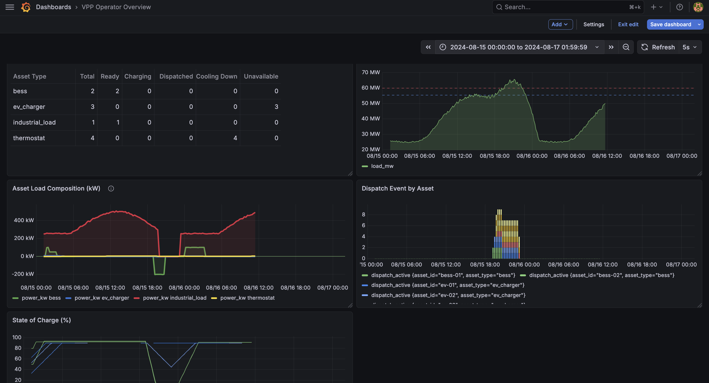

# VPP Simulator

A end-to-end Virtual Power Plant (VPP) simulation built to demonstrate grid-edge data engineering, MQTT-based pub/sub architecture, time series data pipelines, and real-time operational dashboards — applied to the energy sector.

The simulator models a realistic VPP operator managing a fleet of distributed energy resources (DERs) against a synthetic ERCOT-shaped grid load curve, with a priority-dispatch coordinator that responds to peak load events in real time.



---

## What is a VPP and why does it matter?

Utilities and grid operators are facing a structural challenge: electricity demand is becoming harder to predict and manage as more intermittent renewables (solar, wind) come online, and as electrification of transportation and buildings drives new load patterns. Traditional solutions — building new peaker plants — are expensive, slow, and carbon-intensive.

A Virtual Power Plant aggregates distributed energy resources (home batteries, EV chargers, smart thermostats, commercial loads) into a coordinated, dispatchable resource. Instead of building a new gas peaker to handle the evening peak, a VPP operator can dispatch thousands of small assets simultaneously to reduce demand or inject stored energy — achieving the same grid stability outcome at a fraction of the cost.

This project simulates exactly that: a VPP coordinator managing a small fleet of DERs against a realistic ERCOT-shaped load curve, dispatching assets in priority order as grid stress events develop.

---

## Architecture

The simulation uses a pub/sub architecture that mirrors real-world industrial IoT and grid-edge deployments:

```
┌─────────────────────────────────────────────────────────────┐
│                        Asset Fleet                          │
│  BESS × 2   EV Charger × 3   Thermostat × 4   Industrial  │
│                          │                                  │
│              publish state every 15 sim-min                 │
│                    vpp/assets/{id}/state                    │
└────────────────────────┬────────────────────────────────────┘
                         │
                         ▼
              ┌─────────────────┐
              │   Mosquitto     │  MQTT broker
              │   (port 1883)   │  topic namespace:
              └────┬───────┬────┘  vpp/assets/{id}/state
                   │       │       vpp/assets/{id}/dispatch
          ┌────────┘       └──────────┐
          ▼                           ▼
┌──────────────────┐       ┌──────────────────────┐
│  Coordinator     │       │   InfluxDB Writer    │
│                  │       │                      │
│  - reads state   │       │  - subscribes to all │
│  - computes net  │       │    asset state topics │
│    grid load     │       │  - writes time series│
│  - publishes     │       │    to InfluxDB       │
│    dispatch      │       └──────────┬───────────┘
│    signals       │                  │
└──────────────────┘                  ▼
                             ┌─────────────────┐
                             │    InfluxDB     │
                             │   (port 8086)   │
                             └────────┬────────┘
                                      │
                                      ▼
                             ┌─────────────────┐
                             │    Grafana      │
                             │   (port 3000)   │
                             │  live dashboard │
                             └─────────────────┘
```

All services run locally via Docker Compose. The Python simulation (assets, coordinator, grid publisher, InfluxDB writer) runs as a single process with each component in its own thread.

---

## Asset Fleet

### Battery Energy Storage System (BESS)
Two 200kW / 400kWh grid-connected batteries with a 2-hour discharge duration. The coordinator directs charging during overnight load troughs (price-based arbitrage) and dispatches discharge during evening peak events. Each BESS self-reports its `dispatchable_kw` — the maximum power available given its current state of charge — so the coordinator never needs to know internal battery management system (BMS) parameters. This mirrors real VPP architecture where the BMS enforces hard limits and the coordinator operates at a higher abstraction level.

### EV Charger with V2G (Vehicle-to-Grid)
Three Level 2 (7.2kW) bidirectional EV chargers modeled with realistic driver behavior: each vehicle has a plug-in time, departure time, and minimum state of charge the driver requires at departure. The coordinator can dispatch three distinct strategies: V2G discharge (export to grid above driver minimum SoC), smart charge pause (shed charging load if there is sufficient time to reach driver minimum before departure), or autonomous charging resume. A `safe_to_pause` field is computed and published by each asset so the coordinator can make safe dispatch decisions without knowing driver schedules directly.

### Smart Thermostat
Four residential HVAC systems modeled with outdoor temperature-driven load and thermal lag. Load is proportional to the gap between indoor and outdoor temperature. Curtailment raises the cooling setpoint by 4°F, reducing how hard the HVAC runs. Because buildings have thermal mass, load reduction is gradual — the full effect takes several intervals. Critically, when curtailment is released the indoor temperature has drifted up, causing a **rebound spike** as the HVAC works to recover. The coordinator manages this with a cooldown period after thermostat release.

### Commercial / Industrial Load
One large interruptible load (500kW peak) that can island — disconnect from the grid and switch to backup generation — shedding its full load instantly. This is modeled after ERCOT's Interruptible Load (IL) program, where large industrial customers receive rate discounts in exchange for agreeing to curtail on short notice during grid emergencies. A minimum island duration is enforced to protect industrial equipment from rapid cycling.

---

## Coordinator Logic

The coordinator subscribes to all asset state topics, aggregates net grid load (baseline + asset load), and evaluates dispatch decisions every 5 simulated minutes.

### Dispatch Priority Stack

Assets are dispatched in order of least to most disruptive:

| Priority | Asset | Action | Why |
|----------|-------|---------|-----|
| 1 | BESS | Discharge | Fast, no customer impact |
| 2 | EV Charger | V2G discharge | Fast, minimal impact above driver minimum |
| 3 | EV Charger | Pause charging | No range impact if `safe_to_pause` |
| 4 | Thermostat | Curtail setpoint | Small comfort impact, gradual |
| 5 | Industrial Load | Island | Disruptive, last resort |

The coordinator escalates one tier per loop iteration — dispatching BESS first and waiting to see if it brings load below the dispatch threshold before calling on more disruptive resources.

### Hysteresis

Dispatch fires at **60 MW** (92% of peak). Assets are not released until load drops to **55 MW** (85% of peak). This hysteresis band prevents rapid on/off cycling — without it, a dispatched BESS that successfully reduces load would immediately be released, load would climb, and dispatch would fire again in a tight feedback loop.

### Thermostat Rebound Protection

After releasing thermostats from curtailment, they enter a **cooldown state** for 45 simulated minutes during which the coordinator excludes their load from the net load calculation. This prevents the rebound spike from triggering another curtailment cycle and creating an oscillation loop.

### BESS Charge Management

Separate from the dispatch stack, the coordinator directs BESS charging during overnight load troughs (below 45 MW). When load rises above this threshold, charging stops and the BESS stands by for potential dispatch. This simulates price-based energy arbitrage — charge cheap at night, discharge during peak events — without the BESS needing any knowledge of grid conditions.

---

## Simulated Time

The simulation runs at **360x real time** — one real second equals 6 simulated minutes, so a full simulated day completes in 4 real minutes. All asset physics (state of charge changes, thermal dynamics) operate on simulated time intervals so behavior scales correctly regardless of the time compression factor.

The simulation always starts at midnight on **August 15, 2024** — a representative hot Texas summer day — so the Grafana dashboard time range never needs to be updated between runs.

---

## Dashboard

The Grafana dashboard provides a real-time operator view across five panels:

**Grid Load Overview** — Baseline load curve against dispatch (60 MW) and release (55 MW) threshold lines. Shows when and how severely the grid is stressed.

**Asset Statuses** — Fleet summary table showing count of assets in each state (Ready / Charging / Dispatched / Cooling Down / Unavailable) by asset type. Updates every 5 seconds.

**Asset Load Composition** — Per-asset-type load in kW, centered at zero. Positive = consuming from grid, negative = exporting. BESS discharge appears below zero during peak events.

**Dispatch Event by Asset** — Stacked bar chart showing which asset types were dispatched and when. Bar height reflects how many tiers deep the coordinator had to go — a tall bar reaching into thermostats and industrial means BESS and EV alone weren't sufficient.

**State of Charge** — BESS and EV SoC over time. Shows overnight charge cycles, dispatch drawdown, and EV availability windows.

---

## Data Sources and Limitations

**Grid baseline load** is synthetic — a parameterized curve calibrated to ERCOT's publicly documented summer load shape (overnight trough ~25 MW, midday plateau ~55 MW, evening peak ~65 MW at the service territory scale modeled). Random noise is added each interval to simulate real load variation.

**Substituting real ERCOT data** is straightforward — the `grid/baseline.py` module includes inline comments and a documented swap path using ERCOT's public API (`/api/public-reports/act-sys-load-by-wzn`). The rest of the simulation is agnostic to whether the baseline is synthetic or real.

**Asset parameters** (power ratings, battery capacities, charge rates) are representative of commercially available hardware but are not calibrated to specific products.

**The fleet is small by design** — 2 BESS, 3 EVs, 4 thermostats, 1 industrial load is intentionally minimal to keep the simulation readable and the dispatch logic visible in the dashboard. A production VPP would manage thousands of assets; the coordinator architecture scales horizontally.

---

## Tech Stack

| Layer | Technology |
|-------|-----------|
| Message broker | Eclipse Mosquitto (MQTT) |
| Asset simulation | Python, paho-mqtt |
| Time series database | InfluxDB 2.0 |
| Dashboard | Grafana |
| Containerization | Docker Compose |
| Python libraries | paho-mqtt, influxdb-client, python-dotenv |

---

## Running the Simulation

**Prerequisites:** Docker Desktop, Python 3.10+

```bash
# Clone the repository
git clone https://github.com/YOUR_USERNAME/vpp-simulator.git
cd vpp-simulator

# Start infrastructure (Mosquitto, InfluxDB, Grafana)
docker compose up -d

# Set up Python environment
python -m venv venv
source venv/bin/activate
pip install -r requirements.txt

# Configure environment
cp .env.example .env  # credentials are pre-filled for local development

# Run the simulation (completes in ~8 minutes — 2 simulated days)
python run_simulation.py
```

**Grafana dashboard:** http://localhost:3000 (admin / admin)

Set the time range to `2024-08-15 00:00:00` → `2024-08-17 00:00:00` with 5s auto-refresh.

**To run a fresh simulation:**
```bash
./reset_data.sh      # clears InfluxDB
python run_simulation.py
```

---

## Future Work

**Real ERCOT market data integration** — Replace the synthetic baseline with live or historical data from ERCOT's public API. Extend the coordinator to consume real-time LMP (Locational Marginal Price) signals and dispatch based on price thresholds rather than load thresholds, which is closer to how real VPP operators monetize their fleet.

**Price signal optimization** — Implement a simple dispatch optimizer that maximizes revenue across the day-ahead and real-time markets (ERCOT DAM/RTM) rather than using fixed load thresholds. This would require modeling the BESS as a price-taking market participant.

**Fleet scaling** — The coordinator architecture supports arbitrary fleet sizes. Testing with 50-100 assets per type would validate the pub/sub and InfluxDB write patterns under more realistic message volumes.

**Hosted live demo** — Package the simulation as a web application where visitors can trigger a simulation run and watch the Grafana dashboard update in real time, without needing to install anything locally.

**Additional asset types** — Rooftop solar with curtailment capability, demand response-enrolled commercial HVAC, and grid-scale long-duration storage (e.g. iron-air batteries) would round out the DER mix and enable more interesting coordinator strategies.

**ERCOT ancillary services** — Extend the BESS model to participate in ERCOT's ancillary services markets (REGUP, REGDN, RRS, ECRS), which require sub-second response capability and introduce frequency regulation as a dispatch signal alongside load-based dispatch.

---

## Background

This project was built as part of a career transition into energy data engineering, with a focus on grid stability, VPP operations, and distributed energy resource management. The design draws on publicly available documentation from ERCOT, FERC Order 2222 (which opened wholesale markets to DER aggregators), and industry literature on VPP architecture and demand response program design.

The MQTT topic namespace structure, coordinator-asset separation of concerns, and InfluxDB tagging schema are designed to reflect patterns used in real industrial IoT and grid-edge deployments, not just to satisfy the simulation requirements.
